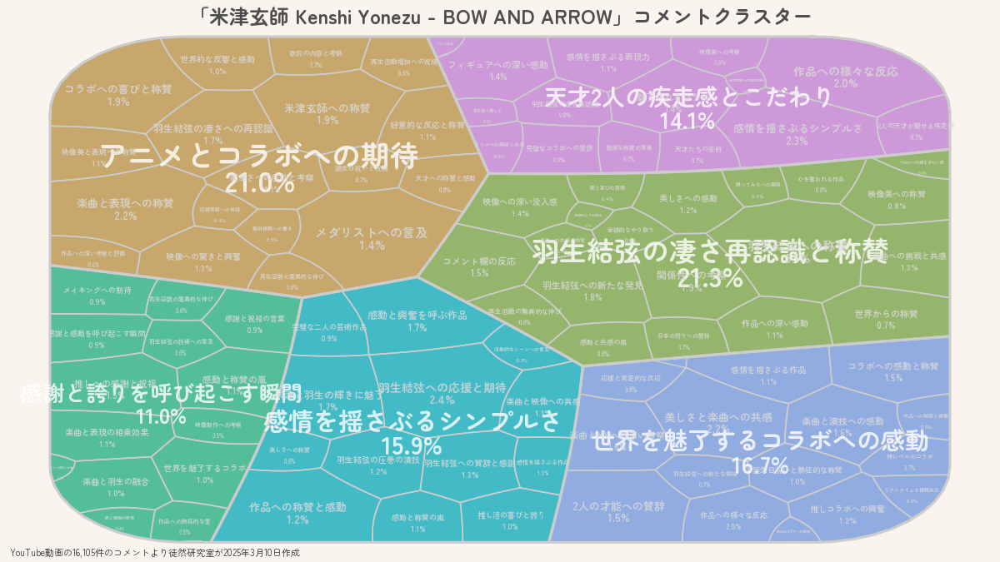
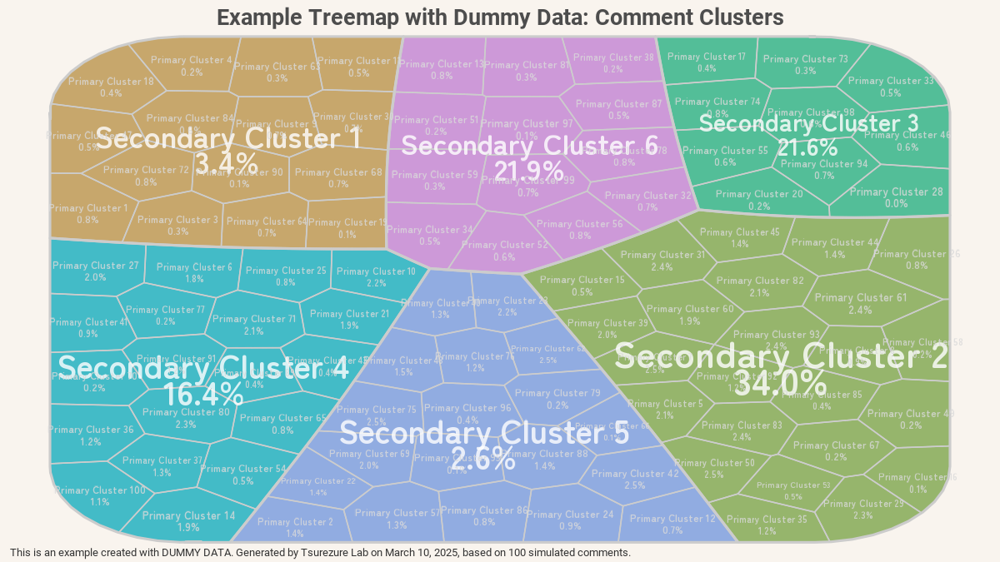

# WeightedTreemaps (Forked Version)
Forked by tsurezure-lab from the original m-jahn/WeightedTreemaps  
Last updated: March 19, 2025

[](https://github.com/tsurezure-lab/WeightedTreemaps/issues) [](https://github.com/tsurezure-lab/WeightedTreemaps/commits/main)  [](https://www.r-project.org/) [](https://github.com/tsurezure-lab/WeightedTreemaps)


## Overview

This repository hosts a forked version of the WeightedTreemaps R package, originally developed by Michael Jahn, David Leslie, Ahmadou Dicko, and Paul Murrell. The package allows users to generate and visualize hierarchical data using Voronoi Treemaps and Sunburst Treemaps. This fork enhances the original by adding the ability to display cluster ratio labels (in percentage) on Voronoi treemaps, improving the interpretability of cluster-based data visualizations.

## Key Features
### Inherited from Original
- Generate Voronoi Treemaps with additively weighted tessellation and nested hierarchical levels.
- Create Sunburst Treemaps with circular sectors sized by predefined weights.
- Customize graphical parameters such as colors, borders, labels, and legends via the `drawTreemap()` function.
- Compatible with Shiny apps (see ShinyTreemaps).

### Added in This Fork
- **Ratio Labels for Voronoi Treemaps**: Display percentage ratios (e.g., "85.4%") alongside cell names, based on `primary_cluster_ratio` and `secondary_cluster_ratio` columns in the input data. This feature is exclusive to Voronoi treemaps and enhances cluster analysis visualization.

## Installation
Install this forked version directly from GitHub:

```r
devtools::install_github("tsurezure-lab/WeightedTreemaps")
```

## Dependencies
- Requires RcppCGAL for C++-based Voronoi tessellation. It is typically installed automatically, but if issues arise, install manually from GitHub.
- Other dependencies: `dplyr`, `grid`, `colorspace`, `scales`, `lattice`.

## Usage

### Basic Usage (Inherited)
Generate and draw a simple Voronoi treemap:

```r
library(WeightedTreemaps)

# Prepare example data
data(mtcars)
mtcars$car_name <- gsub(" ", "\n", row.names(mtcars))

# Generate Voronoi treemap
tm <- voronoiTreemap(
  data = mtcars,
  levels = c("gear", "car_name"),
  cell_size = "wt",
  shape = "rounded_rect",
  seed = 123
)

# Draw treemap
drawTreemap(tm, label_size = 2.5, label_color = "white")
```

### New Feature: Displaying Ratio Labels
If your data includes cluster names and ratios, you can visualize them as percentage labels:

```r
# 必要なライブラリを読み込む / Load necessary libraries
library(WeightedTreemaps) # 重み付きツリーマップ作成用 / For creating weighted treemaps
library(dplyr)          # データ操作用 / For data manipulation
library(showtext)       # フォントを扱う用 / For handling fonts
library(grid)           # グラフィックス描画用 / For graphics rendering
library(ggplot2)        # グラフ作成用 / For creating plots
library(png)            # PNG画像の読み込み/書き出し用 / For reading/writing PNG images

# Googleフォントを追加 / Add Google Fonts
font_add_google("Zen Maru Gothic", "zenmaru") # 日本語フォント / Japanese font
font_add_google("Roboto", "roboto")          # 英語フォント (例) / English font (example)
showtext_auto() # showtextによるフォントの自動使用を有効にする / Enable automatic font usage with showtext

# ダミーデータ生成関数 / Dummy data generation function
generate_dummy_data <- function() {
  set.seed(42) # 結果の再現性のため / For reproducibility of results

  # primary_cluster (合計100種類) / primary_cluster (100 total)
  num_primary_clusters <- 100
  primary_cluster_names <- paste("Primary Cluster", 1:num_primary_clusters)
  primary_cluster_ids <- 1:num_primary_clusters

  # secondary_cluster (6種類) / secondary_cluster (6 total)
  num_secondary_clusters <- 6
  secondary_cluster_names <- paste("Secondary Cluster", 1:num_secondary_clusters)
  secondary_cluster_ids <- 1:num_secondary_clusters

  # 各primary_clusterがどのsecondary_clusterに属するかをランダムに決定 / Randomly assign each primary_cluster to a secondary_cluster
  primary_to_secondary <- sample(secondary_cluster_ids, num_primary_clusters, replace = TRUE)

  # データフレームの初期化 / Initialize data frame
  df <- data.frame(
    primary_cluster = integer(),
    primary_cluster_name = character(),
    primary_cluster_ratio = numeric(),
    secondary_cluster = integer(),
    secondary_cluster_name = character(),
    secondary_cluster_ratio = numeric(),
    stringsAsFactors = FALSE
  )

  # primary cluster ratio のためのデータ数 / Number of data points for primary cluster ratio
  num_data_per_primary <- sample(1:30, num_primary_clusters, replace = TRUE)
  total_data_count <- sum(num_data_per_primary)

  # secondary_cluster_ratioを先に決定 (合計が100になるように) / Determine secondary_cluster_ratio beforehand (to sum up to 100)
  sec_ratios <- runif(num_secondary_clusters)
  sec_ratios <- round(sec_ratios / sum(sec_ratios) * 100, 2)

  # 各プライマリクラスタに対してループ / Loop through each primary cluster
  for (i in 1:num_primary_clusters) {
    # primary clusterの情報 / primary cluster information
    p_id <- primary_cluster_ids[i]
    p_name <- primary_cluster_names[i]
    p_ratio <- round(num_data_per_primary[i] / total_data_count * 100, 2)

    # このprimary clusterが属するsecondary cluster / The secondary cluster this primary cluster belongs to
    sec_cluster <- primary_to_secondary[i]
    sec_cluster_name <- secondary_cluster_names[sec_cluster]

    # secondary_cluster_ratio を取得 / Get secondary_cluster_ratio
    s_ratio <- sec_ratios[sec_cluster]

    # データフレームに追加 / Add to data frame
    temp_df <- data.frame(
      primary_cluster = p_id,
      primary_cluster_name = p_name,
      primary_cluster_ratio = p_ratio,
      secondary_cluster = sec_cluster,
      secondary_cluster_name = sec_cluster_name,
      secondary_cluster_ratio = s_ratio,
      stringsAsFactors = FALSE
    )
    df <- rbind(df, temp_df)
  }

  # primary_cluster_ratioを調整（偏りと合計100）/ Adjust primary_cluster_ratio (bias and sum to 100)
  df <- df %>%
    group_by(secondary_cluster) %>%
    mutate(row_count = n()) %>%
    ungroup() %>%
    mutate(primary_cluster_ratio = ifelse(row_count > mean(row_count), primary_cluster_ratio * 1.5, primary_cluster_ratio * 0.5)) %>%
    select(-row_count) %>%
    ungroup() %>%
    mutate(primary_cluster_ratio = round(primary_cluster_ratio / sum(primary_cluster_ratio) * 100, 2))


  return(df)
}
# ダミーデータを生成 / Generate dummy data
df <- generate_dummy_data()

# データ準備: 一次クラスタと二次クラスタを別々に集計する / Data preparation: Aggregate primary and secondary clusters separately

# 二次クラスタごとの件数、二次クラスタの比率を計算 / Calculate the number of cases and ratio for each secondary cluster
df_secondary <- df %>%
  group_by(secondary_cluster_name) %>%  # 二次クラスタ名でグループ化 / Group by secondary cluster name
  summarise(
    count = n(),                        # 各グループの件数をカウント / Count the number of cases in each group
    secondary_cluster_ratio = first(secondary_cluster_ratio),  # first() を使用 / Use first()
    .groups = 'drop'                      # グループ化を解除 / Ungroup
  ) %>% filter(count > 0)                 # 件数が0より大きいもののみ抽出 / Filter out clusters with 0 count

# 一次クラスタごとの件数、一次クラスタの比率を計算 / Calculate the number of cases and ratio for each primary cluster
df_primary <- df %>%
  group_by(primary_cluster_name) %>%    # 一次クラスタ名でグループ化 / Group by primary cluster name
  summarise(
    count = n(),                          # 各グループの件数をカウント / Count the number of cases in each group
    primary_cluster_ratio = mean(primary_cluster_ratio, na.rm = TRUE), # 一次クラスタ比率の平均を計算 (欠損値は除外) / Calculate the mean of primary cluster ratios (excluding missing values)
    .groups = 'drop'                      # グループ化を解除 / Ungroup
  ) %>% filter(count > 0)                 # 件数が0より大きいもののみ抽出 / Filter out clusters with 0 count

# 二次クラスタと一次クラスタの組み合わせごとの件数を計算し、 / Calculate the number of cases for each combination of secondary and primary clusters,
# 二次クラスタ比率と一次クラスタ比率を追加する / and add secondary and primary cluster ratios
df_counts <- df %>%
  group_by(secondary_cluster_name, primary_cluster_name) %>%  # 二次クラスタ名と一次クラスタ名でグループ化 / Group by secondary and primary cluster names
  summarise(
    count = n(),                          # 各グループの件数をカウント / Count the number of cases in each group
    .groups = 'drop'                      # グループ化を解除 / Ungroup
  ) %>%
  filter(count > 0) %>%                 # 件数が0より大きいもののみ抽出 / Filter out combinations with 0 count
  left_join(df_secondary %>% select(secondary_cluster_name, secondary_cluster_ratio), by = "secondary_cluster_name") %>% # 二次クラスタ情報を結合 / Join secondary cluster information
  left_join(df_primary %>% select(primary_cluster_name, primary_cluster_ratio), by = "primary_cluster_name")          # 一次クラスタ情報を結合 / Join primary cluster information

# Voronoi Treemap (ボロノイ図) を作成 / Create Voronoi Treemap
tm <- voronoiTreemap(
  data = df_counts,                                           # ツリーマップのデータ / Data for the treemap
  levels = c("secondary_cluster_name", "primary_cluster_name"), # 階層構造を指定 (二次クラスタ -> 一次クラスタ) / Specify hierarchical structure (secondary cluster -> primary cluster)
  cell_size = "count",                                        # セルの大きさを決める変数 (件数) / Variable determining cell size (count)
  shape = "rounded_rect",                                     # セルの形状 (角丸四角形) / Cell shape (rounded rectangle)
  positioning = "clustered",                                  # セルの配置方法 (クラスタ化) / Cell arrangement method (clustered)
  error_tol = 0.01,                                           # 許容誤差 / Tolerance for error
  maxIteration = 100,                                         # 最大反復回数 / Maximum number of iterations
  label_ratios = c("primary_cluster_ratio", "secondary_cluster_ratio"), # ラベルとして表示する比率 / Ratios to display as labels
  verbose = TRUE                                              # 詳細なログを出力 / Output detailed logs
)

# 出力画像の幅、高さ、解像度を設定 / Set width, height, and resolution of the output image
width_px <- 1200
height_px <- 675
dpi <- 300
# 出力ファイル名を指定 / Specify output file name
output_filename <- "treemap_example.png"

# ツリーマップを描画するgrob(グラフィカルオブジェクト)を作成 / Create a grob (graphical object) to draw the treemap
treemap_grob <- grid.grabExpr({
  grid::grid.newpage() # 新しい描画ページを作成 / Create a new drawing page

  # ツリーマップ用のビューポートを設定 / Set viewport for treemap
  pushViewport(viewport(y = unit(0.0, "npc"), height = unit(0.0, "npc"), just = "bottom"))
  drawTreemap(tm,
              label_level = c(1, 2),                                     # ラベルを表示する階層 (1: 二次クラスタ, 2: 一次クラスタ) / Hierarchies to display labels (1: secondary cluster, 2: primary cluster)
              label_color = c(adjustcolor(grey(1), alpha.f = 0.8), adjustcolor(grey(0.85), alpha.f = 0.80)), # ラベルの色 / Label colors
              label_size = c(0.8, 1.0),  # ラベルサイズを少し大きく / Slightly increase label size
              label_autoscale = TRUE,                                   # ラベルの自動スケーリングを有効化 / Enable automatic label scaling
              label_fontfamily = "zenmaru",                             # ラベルのフォントファミリー / Label font family
              label_fontweight = "bold",                                 # ラベルのフォントの太さ / Label font weight
              label_line_spacing = c(1.0, 0.0),                         # ラベルの行間 / Label line spacing
              label_ratio = c(1, 2),                                     # 比率を表示するかどうか / Whether to display ratios
              label_ratio_color = c(adjustcolor(grey(1), alpha.f = 0.8), adjustcolor(grey(0.85), alpha.f = 0.80)), # ラベルの色 / Label ratio colors
              label_ratio_size = 0.6,   # 比率のラベルも少し大きく / Slightly increase ratio label size
              label_ratio_fontfamily = "zenmaru",                        # 比率のラベルのフォントファミリー / Ratio label font family
              label_ratio_fontweight = "bold",                           # 比率のラベルのフォントの太さ / Ratio label font weight
              border_size = 1.0,                                         # 境界線の太さ / Border size
              border_color = grey(0.8),                                  # 境界線の色 / Border color
              border_alpha = 0.6,                                       # 境界線の透明度 / Border transparency
              color_type = "categorical",                               # 色のタイプ (カテゴリカル) / Color type (categorical)
              color_level = 1,                                           # 色を適用する階層 (1: 二次クラスタ) / Hierarchy to apply color (1: secondary cluster)
              title = NULL,                                              # タイトルは設定しない / Do not set title
              y_offset = -0.015                                          # ツリーマップを下方に移動 / Move treemap downwards
  )
  popViewport() # ビューポートを元に戻す / Restore viewport

  # タイトル / Title
  grid::grid.text(
    "Example Treemap with Dummy Data: Comment Clusters",
    x = unit(0.5, "npc"),
    y = unit(0.97, "npc"),
    gp = gpar(fontsize = 20, fontfamily = "roboto", fontface = "bold", col = grey(0.3)) # 英語フォント / English font
  )
}, wrap.grobs = TRUE)


# 総レビュー数を計算 / Calculate the total number of reviews
total_reviews <- nrow(df)
# キャプション (英語, ダミーデータと明記) / Caption (English, clearly indicating dummy data)
caption_grob <- textGrob(
  paste0("This is an example created with DUMMY DATA. Generated by Tsurezure Lab on March 10, 2025, based on ", format(total_reviews, big.mark = ","), " simulated comments."),
  x = unit(0.01, "npc"),
  y = unit(0.01, "npc"),
  hjust = 0,
  vjust = 0,
  gp = gpar(fontsize = 10, fontfamily = "roboto", fontface = "plain", col = grey(0.2))  # 英語フォント, サイズ調整 / English font, size adjustment
)

# 最終的なプロットを作成 / Create final plot
final_plot <- ggplot() +
  annotation_custom(treemap_grob) +   # ツリーマップのgrobを追加 / Add treemap grob
  annotation_custom(caption_grob) +  # キャプションのgrobを追加 / Add caption grob
  theme_void() +                     # 空白のテーマを使用 (軸などを非表示) / Use a blank theme (hide axes, etc.)
  theme(plot.background = element_rect(fill = "#F9F4EE", color = NA)) # 背景色を設定 / Set background color

# グラフを保存 / Save the plot
ggsave(output_filename, final_plot, width = width_px, height = height_px, units = "px", dpi = dpi)
img <- readPNG(output_filename)
grid::grid.raster(img)

cat("### 処理が正常に終了しました ###\n") # / Process completed successfully
cat("### Process completed successfully ###\n")
```

#### Output

*   Level 1 cells (e.g., "Secondary A") display the  `secondary_cluster_ratio` for that cluster (e.g., "15.2%").  The sum of the `secondary_cluster_ratio` values across all Level 1 cells will be approximately 1 (100%).
*   Level 2 cells (e.g., "Primary 1") display the `primary_cluster_ratio` for that specific primary cluster (e.g., "8.7%"). The sum of the `primary_cluster_ratio` values *within each Level 1 cell* will be approximately 1 (100%).  The displayed ratios correspond to the `label_ratios` argument in `voronoiTreemap` and the `label_ratio` argument in `drawTreemap`.
*  
## Data Structure for Ratio Labels

To utilize the ratio label feature, your input data (passed to the `data` argument of `voronoiTreemap`) must be a data frame with the following specific structure:

*   **`primary_cluster`**: (Integer) A unique identifier for each primary cluster.
*   **`primary_cluster_name`**: (Character) The name of the primary cluster (e.g., "Primary Cluster 1").  This will be displayed as the larger label within each cell.
*   **`primary_cluster_ratio`**: (Numeric) The ratio (percentage) of this primary cluster *within its parent secondary cluster*. The sum of `primary_cluster_ratio` values for all primary clusters belonging to the *same* secondary cluster should be approximately 100%.
*   **`secondary_cluster`**: (Integer) A unique identifier for each secondary cluster.
*   **`secondary_cluster_name`**: (Character) The name of the secondary cluster (e.g., "Secondary Cluster A"). This will be displayed as the smaller label above the primary cluster names.
*   **`secondary_cluster_ratio`**: (Numeric) The ratio (percentage) of this secondary cluster *relative to all other secondary clusters*. The sum of `secondary_cluster_ratio` values across *all* secondary clusters should be approximately 100%.

**Example:**

| primary_cluster | primary_cluster_name | primary_cluster_ratio | secondary_cluster | secondary_cluster_name | secondary_cluster_ratio |
|-----------------|----------------------|-----------------------|-------------------|------------------------|-------------------------|
| 1               | Primary Cluster 1    | 25.5                  | 1                 | Secondary Cluster A    | 40.2                    |
| 2               | Primary Cluster 2    | 74.5                  | 1                 | Secondary Cluster A    | 40.2                    |
| 3               | Primary Cluster 3    | 40.0                  | 2                 | Secondary Cluster B    | 59.8                    |
| 4               | Primary Cluster 4    | 60.0                  | 2                 | Secondary Cluster B    | 59.8                    |

In this example:

*   "Secondary Cluster A" has a `secondary_cluster_ratio` of 40.2%, meaning it represents 40.2% of the entire dataset.
*   "Primary Cluster 1" has a `primary_cluster_ratio` of 25.5%.  This means that *within "Secondary Cluster A"*, "Primary Cluster 1" accounts for 25.5% of the data.
*   The `primary_cluster_ratio` values for "Primary Cluster 1" and "Primary Cluster 2" (both within "Secondary Cluster A") add up to 100%.
*   The `secondary_cluster_ratio` values for all secondary clusters sum up to 100%

**Important:** The `voronoiTreemap` function uses the `count` column (number of rows) for the cell size, and it expects the ratio columns to pre-calculated. It does *not* perform any calculations of the ratios itself.

## Differences from the Original
- **Ratio Labels**: Added support in `drawTreemap()` to display percentage ratios for Voronoi treemaps, calculated from `primary_cluster_ratio` and `secondary_cluster_ratio` in the input data. This feature is not applied to Sunburst treemaps, which retain the original single-level label behavior.
- **No Other Changes**: All other functionalities (coloring, borders, legends, etc.) remain identical to the original.

## Requirements
- R version 3.5 or higher.
- Dependencies listed above (automatically handled by installation).

## Contributing
Contributions are welcome! Please submit bug reports or feature requests via Issues. Pull requests are also appreciated.

## License
This forked version is released under the GPL-3 License, consistent with the original package. See the LICENSE file for details.

## Acknowledgments
- **Original Authors**: Michael Jahn, David Leslie, Ahmadou Dicko, Paul Murrell.
- **Fork Author**: tsurezure-lab.  
This project builds upon the excellent work of the original m-jahn/WeightedTreemaps.

## Notes
- If your data lacks the required `primary_cluster_*` or `secondary_cluster_*` columns, the treemap will fall back to displaying only cell names, maintaining compatibility with the original behavior.
- For advanced examples (e.g., parallel computing, custom shapes), refer to the original README.
